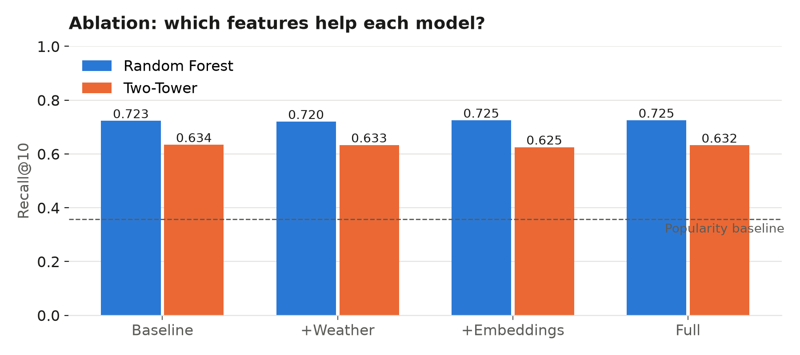
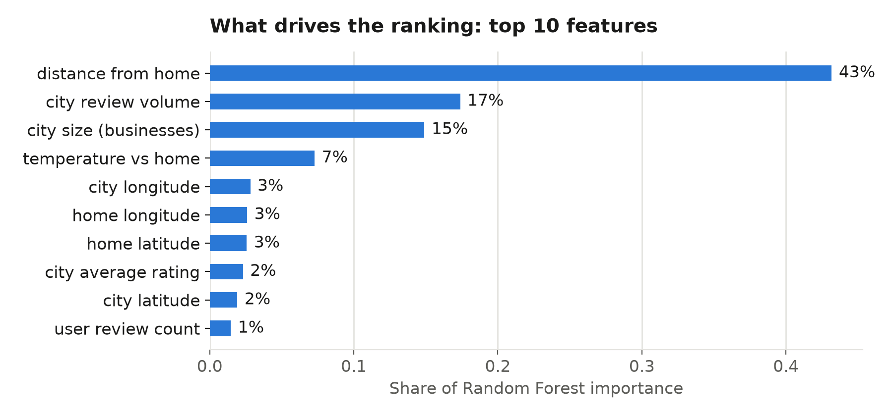
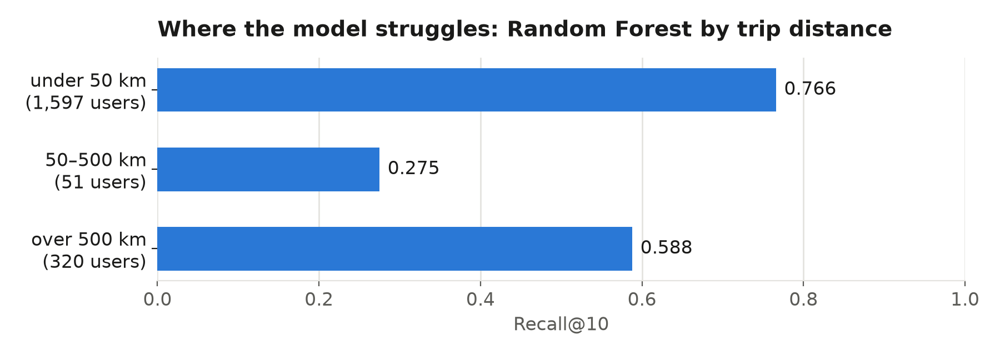

# Context-Aware Travel Destination Recommendation

**CS 582: Machine Learning Course Project**

A machine learning system that recommends travel destinations based on traveler preferences, trip context, and semantic information from reviews. Instead of recommending cities only by popularity, this system learns which destinations match different types of travelers.

## Project Overview

### Novelty

We combine four sources of information in one destination recommendation system:
1. **Behavior-based preferences** — what users have actually reviewed and rated
2. **Trip context** — selected travel month and preferred climate/activities  
3. **Month-specific weather** — historical climate data relevant to travel date
4. **Semantic review embeddings** — what people actually say in reviews (not just ratings)

We experimentally measure the contribution of weather and review embeddings by comparing different feature combinations.

### Research Questions

1. Does month-specific weather information improve recommendation quality?
2. Do Transformer review embeddings provide useful information beyond ratings and categories?
3. Does combining weather and review information produce better recommendations?
4. Does the two-tower neural network outperform Random Forest and simpler baselines?

## Project Structure

```
├── data/
│   ├── raw/              # Raw Yelp dataset (5GB JSONL files)
│   ├── processed/        # Cleaned and filtered data
│   ├── samples/          # 10% sample for development
│   └── cache/            # Cached embeddings and preprocessed data
│
├── src/
│   ├── data/             # Data loading and preprocessing
│   │   ├── loader.py     # Load Yelp JSONL with sampling
│   │   ├── normalizer.py # City name normalization, city filtering
│   │   └── cache.py      # Cache embeddings and dataframes
│   │
│   ├── features/         # Feature engineering
│   │   ├── user_features.py          # Extract user preferences
│   │   ├── destination_features.py   # Extract city characteristics
│   │   └── weather_features.py       # (Phase 2) Climate data
│   │
│   ├── models/           # Recommendation models
│   │   ├── baselines.py              # Popularity, Cosine Similarity
│   │   ├── random_forest.py          # (Phase 4)
│   │   ├── two_tower.py              # (Phase 4) Neural network
│   │   └── embedding_utils.py        # (Phase 3) Review embeddings
│   │
│   └── evaluation/       # Evaluation metrics
│       ├── harness.py    # Train/test split, test pair construction
│       └── metrics.py    # Recall@K, NDCG@K, MRR
│
├── notebooks/           # Organized by phase
│   ├── phase1_data_prep/      # Data preparation & baselines
│   │   ├── 01_data_loading.ipynb
│   │   ├── 02_destination_filtering.ipynb
│   │   ├── 03_cross_city_users.ipynb
│   │   ├── 04_feature_engineering.ipynb
│   │   ├── 05_evaluation_harness.ipynb
│   │   └── 06_baselines.ipynb
│   ├── phase2_weather/        # Weather features
│   ├── phase3_embeddings/     # Review embeddings
│   ├── phase4_models/         # ML models
│   ├── phase5_ablation/       # Feature ablation
│   └── phase6_analysis/       # Results and visualization
│
├── outputs/             # Phase-specific results
│   ├── phase1/
│   ├── phase2/
│   └── ...
│
├── models/              # Saved model checkpoints
├── reports/figures/     # Generated plots
├── config.py            # Phase-specific configuration
├── requirements.txt     # Python dependencies
└── README.md
```

## Setup

1. **Create virtual environment:**
   ```bash
   python -m venv venv
   source venv/bin/activate  # Windows: venv\Scripts\activate
   ```

2. **Install dependencies:**
   ```bash
   pip install -r requirements.txt
   ```

3. **Place Yelp data:**
   Download from [yelp.com/dataset](https://www.yelp.com/dataset) and place in `data/raw/`:
   - `yelp_academic_dataset_business.json`
   - `yelp_academic_dataset_review.json`
   - `yelp_academic_dataset_user.json`

## Data

### Yelp Open Dataset
- **Businesses**: locations, categories, ratings, review counts
- **Reviews**: user ratings, timestamps, text
- **Users**: user review history

### Open-Meteo (Phase 2)
- Historical weather and climate data by location and month

### Constructed Labels
Since we don't have explicit "user A → destination B = good" labels, we construct them (leave-one-city-out):
- **Positive**: one city the user visited, hidden from their history (any visit, not only 5★, to keep enough data)
- **Negative**: 4 cities the user never reviewed
- **History**: all other reviews; user features come only from here, so the answer never leaks in
- **Home city**: the city with the user's most history reviews
- **Filter**: Users with ≥2 cities and ≥10 reviews
- **Split**: users 70 / 10 / 20 into train / validation / test (a user is never in two sets)

## Models

| Model | Description | When |
|-------|-------------|------|
| **Popularity Baseline** | Rank by review volume + rating | Phase 1 |
| **Cosine Similarity** | Vector similarity of user vs. destination features | Phase 1 |
| **Random Forest** | Supervised: structured user + destination features | Phase 4 |
| **Two-Tower Network** | Neural network: separate user/destination encoders + dot product | Phase 4 |

## Evaluation Metrics

- **Recall@K** — is held-out city in top-K recommendations?
- **NDCG@K** — ranking quality (position-weighted)
- **MRR@K** — mean reciprocal rank

Train/test split by user (same user never in both).

## Project Timeline

| Phase | Weeks | Deliverable | Status |
|-------|-------|-------------|--------|
| 1. Data Prep & Baselines | 1-6 | Sampling, filtering, evaluation harness, popularity + cosine-sim baselines | ✅ **Complete** |
| 2. Weather Features | 7-8 | Open-Meteo integration, monthly climate features | ✅ **Complete** |
| 3. Review Embeddings | 9 | Sentence-BERT embeddings, caching | ✅ **Complete** |
| 4. ML Models | 10 | Random Forest + Two-Tower training | ✅ **Complete** |
| 5. Ablation Experiments | 11 | Feature combinations, model comparison | ✅ **Complete** |
| 6. Analysis & Presentation | 12 | Visualizations, feature importance, error analysis | ✅ **Complete** |

## Final Results

Ranking ~276 candidate cities for each of 1,968 test users (10% user sample).
Notebook: `notebooks/phase4_models/03_ranking_models.ipynb`.

| Model | Recall@10 | NDCG@10 | MRR@10 |
|-------|-----------|---------|--------|
| Random guess | 0.038 | 0.018 | 0.013 |
| Popularity baseline | 0.358 | 0.180 | 0.126 |
| **Random Forest (Full)** | **0.725** | **0.543** | **0.486** |
| Two-Tower (Baseline) | 0.634 | 0.432 | 0.370 |


### Ablation (Recall@10)

| Config | Random Forest | Two-Tower |
|--------|---------------|-----------|
| Baseline (user + city + distance) | 0.723 | 0.634 |
| +Weather (trip month) | 0.720 | 0.633 |
| +Embeddings (review text) | 0.725 | 0.625 |
| Full | 0.725 | 0.632 |



### Key Findings
1. **RQ4 — models:** Random Forest (0.725) beats Two-Tower (0.634); both double the Popularity baseline (0.358).
2. **RQ1 — weather:** no gain (0.723 → 0.720). 81% of hidden cities are within 50 km of home, so trips share the home climate.
3. **RQ2 — review embeddings:** no meaningful gain (0.723 → 0.725) once distance and city size are known.
4. **RQ3 — combined:** Full config 0.725, same as embeddings alone.
5. **Distance drives the ranking** (43% of RF importance), then city review volume and size.
6. **Error analysis:** Recall@10 is 0.766 for trips under 50 km, 0.588 over 500 km, and 0.275 for 50–500 km (51 users).




Full-data check (19,674 test users): Popularity Recall@10 0.352, Cosine 0.014, matching the 10% sample.

### Deliverables
- ✅ Leave-one-city-out labels and evaluation harness (`src/data/labels.py`, `src/evaluation/harness.py`)
- ✅ Ranking models (`src/models/rankers.py`) and features (`src/features/ranking_features.py`, `src/features/review_embeddings.py`)
- ✅ Results notebook and charts (`notebooks/phase4_models/03_ranking_models.ipynb`, `reports/figures/`)

## Running the Project

### Reproduce the results
Run `notebooks/phase1_data_prep/01`–`05` to build the data and labels, then:

```bash
cd notebooks/phase4_models
jupyter nbconvert --to notebook --execute --inplace 03_ranking_models.ipynb   # ~15 min on the 10% sample
```

Results print in the notebook and the charts are written to `reports/figures/`.

## Quick Links

| Document | Purpose |
|----------|---------|
| **[PROJECT_COMPLETE.md](PROJECT_COMPLETE.md)** | Final project summary & recommendations |
| **[STATUS.md](STATUS.md)** | Current project status & progress |
| **[PHASES.md](PHASES.md)** | Original project plan & timeline |
| **[reports/PHASE_6_FINAL_REPORT.md](reports/PHASE_6_FINAL_REPORT.md)** | Detailed final analysis & findings |

## Model Usage

```python
from src.features.ranking_features import USER_FEATURES, CITY_FEATURES, PAIR_FEATURES, build_pair_features
from src.models.rankers import RandomForestRanker

# train_df: (user_id, city, label) rows with features, built as in notebook 03
rf = RandomForestRanker(USER_FEATURES + CITY_FEATURES + PAIR_FEATURES, max_depth=8).fit(train_df)

# Score a user's candidate cities: higher score = recommend first
scores = rf.score(build_pair_features(candidates, users, cities, months))
print(rf.feature_importance())
```

## Key Configuration (config.py)

```python
# Phase 1 settings
PHASE1_SAMPLE_FRACTION = 0.1          # 10% of 5GB = ~500MB
PHASE1_MIN_BUSINESSES_PER_CITY = 50   # City must have ≥50 businesses
PHASE1_MIN_REVIEWS_PER_CITY = 500     # City must have ≥500 reviews
PHASE1_MIN_USER_CITIES = 2            # User must have reviewed in ≥2 cities
PHASE1_MIN_USER_REVIEWS = 10          # User must have ≥10 reviews
PHASE1_EVAL_K = 10                    # Evaluate Recall@10, NDCG@10, MRR@10
```

## Team

- Nomin Nergui (618649)
- Tumenjargal Altanginj (618048)
- Temuujin Bat Amgalan (619957)
- Temuulen Khuchit (618643)

## References

1. Borràs, Moreno & Valls (2014) — "Intelligent Tourism Recommender Systems: A Survey"
2. Reimers & Gurevych (2019) — "Sentence-BERT: Sentence Embeddings Using Siamese BERT-Networks"
3. He et al. (2017) — "Neural Collaborative Filtering"
4. [Open-Meteo API](https://open-meteo.com/) — Historical weather data
5. [Yelp Open Dataset](https://www.yelp.com/dataset)
