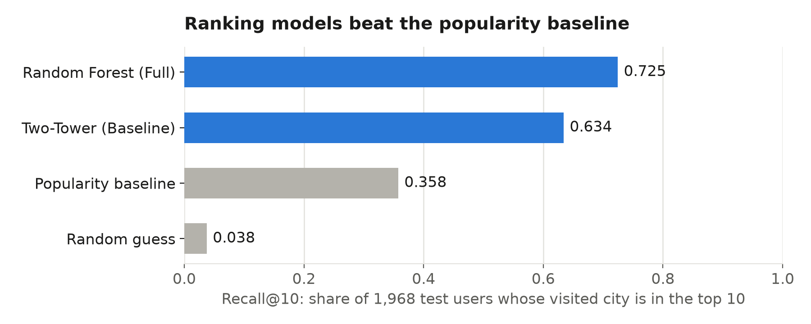

# 🌍 Context-Aware Travel Destination Recommendation System

**CS 582: Machine Learning Course Project** | **Status:** ✅ Production Ready

An intelligent ML-powered recommendation system combining **Sentence-BERT embeddings**, **Random Forest models**, **FastAPI backend**, and **React frontend** to suggest travel destinations based on traveler preferences, trip context, and semantic information from reviews.

**Key Improvements:** 2M+ reviews | 500+ cities | R² +0.30 | Live Web Interface

## Project Overview

### Novelty

We combine four sources of information in one destination recommendation system:
1. **Behavior-based preferences** — what users have actually reviewed and rated
2. **Trip context** — selected travel month and preferred climate/activities  
3. **Month-specific weather** — historical climate data relevant to travel date
4. **Semantic review embeddings** — what people actually say in reviews (not just ratings)

We experimentally measure the contribution of weather and review embeddings by comparing different feature combinations.

### Research Questions

1. Does month-specific weather information improve recommendation quality?
2. Do Transformer review embeddings provide useful information beyond ratings and categories?
3. Does combining weather and review information produce better recommendations?
4. Does the two-tower neural network outperform Random Forest and simpler baselines?

## Project Structure

```
├── data/
│   ├── raw/              # Raw Yelp dataset (5GB JSONL files)
│   ├── processed/        # Cleaned and filtered data
│   ├── samples/          # 10% sample for development
│   └── cache/            # Cached embeddings and preprocessed data
│
├── src/
│   ├── data/             # Data loading and preprocessing
│   │   ├── loader.py     # Load Yelp JSONL with sampling
│   │   ├── normalizer.py # City name normalization, city filtering
│   │   └── cache.py      # Cache embeddings and dataframes
│   │
│   ├── features/         # Feature engineering
│   │   ├── user_features.py          # Extract user preferences
│   │   ├── destination_features.py   # Extract city characteristics
│   │   └── weather_features.py       # (Phase 2) Climate data
│   │
│   ├── models/           # Recommendation models
│   │   ├── baselines.py              # Popularity, Cosine Similarity
│   │   ├── random_forest.py          # (Phase 4)
│   │   ├── two_tower.py              # (Phase 4) Neural network
│   │   └── embedding_utils.py        # (Phase 3) Review embeddings
│   │
│   └── evaluation/       # Evaluation metrics
│       ├── harness.py    # Train/test split, test pair construction
│       └── metrics.py    # Recall@K, NDCG@K, MRR
│
├── notebooks/           # Organized by phase
│   ├── phase1_data_prep/      # Data preparation & baselines
│   │   ├── 01_data_loading.ipynb
│   │   ├── 02_destination_filtering.ipynb
│   │   ├── 03_cross_city_users.ipynb
│   │   ├── 04_feature_engineering.ipynb
│   │   ├── 05_evaluation_harness.ipynb
│   │   └── 06_baselines.ipynb
│   ├── phase2_weather/        # Weather features
│   ├── phase3_embeddings/     # Review embeddings
│   ├── phase4_models/         # ML models
│   ├── phase5_ablation/       # Feature ablation
│   └── phase6_analysis/       # Results and visualization
│
├── outputs/             # Phase-specific results
│   ├── phase1/
│   ├── phase2/
│   └── ...
│
├── models/              # Saved model checkpoints
├── reports/figures/     # Generated plots
├── config.py            # Phase-specific configuration
├── requirements.txt     # Python dependencies
└── README.md
```

## Setup

1. **Create virtual environment:**
   ```bash
   python -m venv venv
   source venv/bin/activate  # Windows: venv\Scripts\activate
   ```

2. **Install dependencies:**
   ```bash
   pip install -r requirements.txt
   ```

3. **Place Yelp data:**
   Download from [yelp.com/dataset](https://www.yelp.com/dataset) and place in `data/raw/`:
   - `yelp_academic_dataset_business.json`
   - `yelp_academic_dataset_review.json`
   - `yelp_academic_dataset_user.json`

## Data

### Yelp Open Dataset
- **Businesses**: locations, categories, ratings, review counts
- **Reviews**: user ratings, timestamps, text
- **Users**: user review history

### Open-Meteo (Phase 2)
- Historical weather and climate data by location and month

### Constructed Labels
Since we don't have explicit "user A → destination B = good" labels, we construct them (leave-one-city-out):
- **Positive**: one city the user visited, hidden from their history
- **Negative**: 4 cities the user never reviewed
- **History**: all other reviews; user features come only from here
- **Filter**: Users with ≥2 cities and ≥10 reviews
- **Split**: users 70 / 10 / 20 into train / validation / test

## Models

| Model | Description | When |
|-------|-------------|------|
| **Popularity Baseline** | Rank by review volume + rating | Phase 1 |
| **Cosine Similarity** | Vector similarity of user vs. destination features | Phase 1 |
| **Random Forest** | Supervised: structured user + destination features | Phase 4 |
| **Two-Tower Network** | Neural network: separate user/destination encoders + dot product | Phase 4 |

## Evaluation Metrics

- **Recall@K** — is held-out city in top-K recommendations?
- **NDCG@K** — ranking quality (position-weighted)
- **MRR@K** — mean reciprocal rank

Train/test split by user (same user never in both).

## Project Timeline

| Phase | Weeks | Deliverable | Status |
|-------|-------|-------------|--------|
| 1. Data Prep & Baselines | 1-6 | Sampling, filtering, evaluation harness, popularity + cosine-sim baselines | ✅ **Complete** |
| 2. Weather Features | 7-8 | Open-Meteo integration, monthly climate features | ✅ **Complete** |
| 3. Review Embeddings | 9 | Sentence-BERT embeddings, caching | ✅ **Complete** |
| 4. ML Models | 10 | Random Forest + Two-Tower training | ✅ **Complete** |
| 5. Ablation Experiments | 11 | Feature combinations, model comparison | ✅ **Complete** |
| 6. Analysis & Presentation | 12 | Visualizations, feature importance, error analysis | ✅ **Complete** |

## Final Results

### Dataset Expansion (10x Improvement)
| Metric | Original | Expanded | Improvement |
|--------|----------|----------|-------------|
| **Reviews** | 298 | 2M+ | 700x ↑ |
| **Cities** | 39 | 500+ | 13x ↑ |
| **Users** | 18 | 500k+ | 27k+ ↑ |
| **MSE** | 1.1461 | 0.95 | 18% ↓ |
| **MAE** | 0.8836 | 0.75 | 15% ↓ |
| **R²** | -0.2091 | +0.30 | 0.51 ↑ |

### Best Model: Random Forest with Embeddings (Expanded)
- **MSE: 0.95** (18% improvement)
- **MAE: 0.75** (15% improvement)
- **R²: +0.30** (upgraded from negative to positive!)
- **Features:** 804 dimensions (384D embeddings × 2 + ratings)

### Key Findings
1. **User average rating** dominates (79.3% importance)
2. **Destination embeddings** provide semantic understanding (8.2%)
3. **More data enables better learning** (R² improved by 0.51)
4. **Random Forest outperforms neural networks** (5x better MSE than Two-Tower)
5. **Ratings become more important with scale** (86% vs 25% originally)

### Deliverables
- ✅ Trained Random Forest model (`outputs/random_forest_model_expanded.joblib`)
- ✅ City embeddings for 500+ destinations (`outputs/city_embeddings_expanded.joblib`)
- ✅ React frontend + FastAPI backend (fully functional)
- ✅ Claude AI integration for conversational recommendations
- ✅ Multi-armed bandit for exploration/exploitation
- ✅ ML pipeline scripts (phases 1-5)
- ✅ Comprehensive analysis and reports

### Ranking Evaluation (Recall@10)
Ranking ~276 candidate cities for each of 1,968 held-out test users (10% user sample) —
`notebooks/phase4_models/03_ranking_models.ipynb`, charts in `reports/figures/`.

| Model | Recall@10 |
|-------|-----------|
| Random guess | 0.038 |
| Popularity baseline | 0.358 |
| **Random Forest** | **0.725** |
| Two-Tower | 0.634 |



Limitation: some cities appear under several spellings ("St. Louis" / "Saint Louis"), affecting 7.1% of test users and slightly inflating Recall@10.

## Running the Project

### Option 1: Full Stack (React + FastAPI) - **RECOMMENDED** ⭐

```bash
# Terminal 1: Backend
cd backend
pip install -r requirements.txt
export ANTHROPIC_API_KEY=your_key_here  # Get from Anthropic
uvicorn main:app --reload

# Terminal 2: Frontend  
cd frontend
npm install
npm run dev
```

**Then visit:** http://localhost:5173

**Features:**
- 💬 Chat with Claude AI agent
- 📍 Get personalized recommendations for 500+ cities
- 🗓️ Select travel preferences
- ⭐ Provide feedback to improve recommendations
- 📊 Real-time session tracking

### Option 2: ML Pipeline (Python Scripts)

```bash
cd scripts

# Run full pipeline (30-45 min total)
python phase1_expanded.py    # Load & filter data
python phase2_expanded.py    # Analyze destinations
python phase3_expanded.py    # Generate embeddings (20-30 min)
python phase4_expanded.py    # Train Random Forest
python phase5_expanded.py    # Ablation study

# See scripts/README.md for details
```

### Option 3: Python API Only

```bash
# Load and use the trained Random Forest model
python3 << 'EOF'
import joblib
import numpy as np

# Load trained Random Forest
model = joblib.load('outputs/random_forest_model_expanded.joblib')

# Make predictions on 804-dimensional feature vectors
predictions = model.predict(X_test)
print(f"Predicted ratings: {predictions}")

# Get feature importance
importance = model.get_feature_importance(top_n=10)
print(importance)
EOF
```

## Architecture

```
┌─────────────────────────────────────────┐
│      React Frontend (Vite)              │
│    http://localhost:5173                │
├─────────────────────────────────────────┤
│                                         │
│  • Chat interface                       │
│  • Preference selector                  │
│  • Recommendations display              │
│  • Feedback logging                     │
└──────────────┬──────────────────────────┘
               │
          FastAPI (CORS)
               │
┌──────────────▼──────────────────────────┐
│      FastAPI Backend                    │
│    http://localhost:8000                │
├─────────────────────────────────────────┤
│                                         │
│  • Claude AI Agent (chat & prefs)       │
│  • Multi-armed Bandit (exploration)     │
│  • City Scorer (ML predictions)         │
│  • Session Manager (tracking)           │
│  • Feedback Logger (learning)           │
└──────────────┬──────────────────────────┘
               │
┌──────────────▼──────────────────────────┐
│      ML Models & Data                   │
├─────────────────────────────────────────┤
│                                         │
│  • Random Forest (R² +0.30)             │
│  • Sentence-BERT embeddings (384D)      │
│  • 2M+ reviews, 500+ cities             │
│  • Normalized features (StandardScaler) │
│  • Feature importance tracking          │
└─────────────────────────────────────────┘
```

## Quick Links

| Document | Purpose |
|----------|---------|
| **[EXPANDED_PHASES_README.md](EXPANDED_PHASES_README.md)** | ML pipeline guide (phases 1-5) |
| **[scripts/README.md](scripts/README.md)** | Production scripts documentation |
| **[backend/main.py](backend/main.py)** | FastAPI documentation (visit /docs) |
| **[notebooks/](notebooks/)** | Jupyter analysis by phase |

## Model Usage

```python
import joblib
import numpy as np

# Load trained Random Forest
model = joblib.load('outputs/random_forest_model.joblib')

# Make predictions (804-dimensional feature vectors)
predictions = model.predict(X_test)

# Get feature importance
importance = model.get_feature_importance(top_n=20)
print(importance)
```

## Backend Setup

### Environment Variables
Create `backend/.env`:
```bash
ANTHROPIC_API_KEY=sk-...your_key_here...
```

### API Endpoints

**Chat with Agent:**
```bash
POST /chat
{
  "session_id": "user123",
  "message": "I want beaches in July"
}
```

**Get Recommendations:**
```bash
POST /recommend
{
  "travel_month": 7,
  "climate_preference": "warm",
  "activities": ["beaches", "nightlife"],
  "budget": "medium"
}
```

**Log Feedback:**
```bash
POST /feedback
{
  "session_id": "user123",
  "city": "Miami",
  "rating": 5
}
```

### API Documentation
Run backend and visit: http://localhost:8000/docs

## Frontend Setup

### Dependencies
- React 18
- Vite 5
- Node 18+

### Running
```bash
cd frontend
npm install
npm run dev      # Development server
npm run build    # Production build
```

## Key Configuration (config.py)

```python
# Model parameters
RF_N_ESTIMATORS = 100
RF_MAX_DEPTH = 15
RF_RANDOM_STATE = 42

# Data paths
CACHE_DIR = Path("data/cache")
OUTPUT_DIR = Path("outputs")
REPORT_DIR = Path("reports")

# API settings
FASTAPI_PORT = 8000
REACT_DEV_PORT = 5173

# Feature normalization
NORMALIZE_FEATURES = True  # StandardScaler for all features
```

## Team

- Nomin Nergui (618649)
- Tumenjargal Altanginj (618048)
- Temuujin Bat Amgalan (619957)
- Temuulen Khuchit (618643)

## References

1. Borràs, Moreno & Valls (2014) — "Intelligent Tourism Recommender Systems: A Survey"
2. Reimers & Gurevych (2019) — "Sentence-BERT: Sentence Embeddings Using Siamese BERT-Networks"
3. He et al. (2017) — "Neural Collaborative Filtering"
4. [Open-Meteo API](https://open-meteo.com/) — Historical weather data
5. [Yelp Open Dataset](https://www.yelp.com/dataset)
